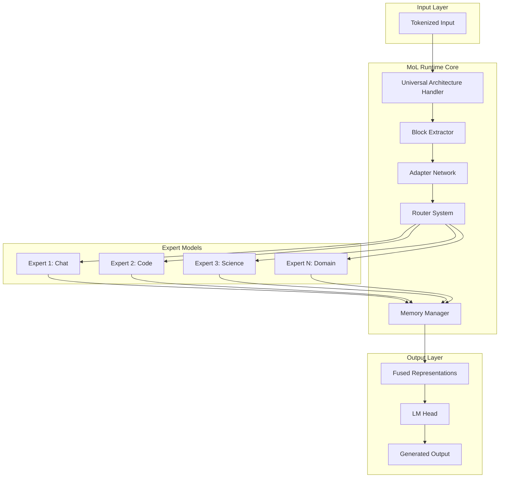

<div align="center">

# 🥭 Project Mango

**Next-Generation Modular Layer (MoL) System for Transformer Model Composition**

[](https://www.python.org/downloads/)
[](https://pytorch.org/)
[](https://opensource.org/licenses/Apache-2.0)
[](https://github.com/OEvortex/project-mango)
[](https://huggingface.co/models)

*Revolutionizing AI model composition through intelligent fusion and merging techniques*

[**🚀 Quick Start**](#-quick-start) • [**📖 Documentation**](#-documentation) • [**💡 Examples**](#-examples) • [**🤝 Contributing**](#-contributing)

---

</div>

## 🌟 **Overview**

Project Mango is a cutting-edge framework that revolutionizes how we combine and compose transformer models. Built on the innovative **Modular Layer (MoL)** architecture, it offers unprecedented flexibility in creating hybrid AI systems that leverage the collective intelligence of multiple specialized models.

### **🎯 Core Value Proposition**

- **🔄 Dynamic Fusion**: Runtime composition with intelligent expert routing
- **🔀 Static Merging**: Permanent weight combination with advanced algorithms
- **🏗️ Universal Architecture**: Support for 120+ transformer architectures
- **🛡️ Security-First**: SafeTensors integration with secure model handling
- **⚡ Performance**: Memory-efficient with lazy loading and optimization
- **🎓 Research-Ready**: Built for both production and experimentation

---

## 🚀 **Quick Start**

### **Installation**

```bash
# Clone and install from source (Beta)
git clone https://github.com/OEvortex/project-mango.git
cd project-mango
pip install -e .
```

### **30-Second Demo**

```python
from mol import MoLRuntime, MoLConfig

# Create a multi-expert system
config = MoLConfig(
    models=["microsoft/DialoGPT-small", "Salesforce/codet5-small"],
    adapter_type="linear",
    router_type="token_level"
)

mol = MoLRuntime(config)
mol.setup_embeddings()
mol.add_layer([("microsoft/DialoGPT-small", 0), ("Salesforce/codet5-small", 0)])

# Intelligent routing between experts
inputs = mol.tokenizer("Write a Python function:", return_tensors="pt")
output = mol.forward(inputs['input_ids'], inputs['attention_mask'])
```

---

## 🧠 **Methodology: Two Paradigms**

### 🔄 **Dynamic Fusion** - Adaptive Expert Orchestration

**When to Use**: Multi-domain applications, experimentation, maximum adaptability

```python
# Intelligent routing across specialized experts
config = MoLConfig(
    models=[
        "microsoft/DialoGPT-small",    # Conversational expert
        "Salesforce/codet5-small",     # Code generation expert  
        "allenai/scibert_scivocab_uncased"  # Scientific expert
    ],
    router_type="token_level",  # Per-token expert selection
    adapter_type="bottleneck"
)
```

**Key Benefits**:
- 🎯 Real-time expert selection based on input content
- 📊 Preserves individual model strengths
- 🎓 Trainable routing and adaptation layers
- 📋 Detailed routing analytics and interpretability

### 🔀 **Static Merging** - Permanent Weight Synthesis

**When to Use**: Production deployment, resource optimization, uniform tasks

```python
# Advanced TIES merging for capability fusion
from mol import TiesMerge
from mol.config import MergeConfig

config = MergeConfig(
    method="ties",
    base_model="microsoft/DialoGPT-medium",
    models=[
        "microsoft/DialoGPT-medium-poetry",
        "microsoft/DialoGPT-medium-science",
        "microsoft/DialoGPT-medium-code"
    ],
    parameters={
        "density": 0.85,
        "normalize": True,
        "majority_sign_method": "total"
    }
)

merger = TiesMerge(config)
merged_model = merger.merge_and_save("./enhanced_model")
```

**Key Benefits**:
- 📦 Single unified model - smaller memory footprint
- ⚡ Faster inference - no routing overhead
- 🛠️ Production-ready - predictable performance
- 📊 Permanent capability integration

---

## 🏗️ **Architecture Excellence**

### **🧩 System Architecture**



### **🔧 Core Components**

| Component | Purpose | Innovation |
|-----------|---------|------------|
| **Universal Architecture Handler** | Automatic detection of 120+ architectures | Zero-config compatibility |
| **Block Extractor** | Intelligent layer extraction | Cross-architecture support |
| **Adapter Network** | Dimensional bridging | Identity initialization |
| **Router System** | Expert selection | Token-level & pooled routing |
| **Memory Manager** | Resource optimization | Lazy loading & offloading |
| **Training Pipeline** | End-to-end optimization | Regularization & balancing |

### **🔒 Security & Reliability**

- **🛡️ SafeTensors Integration**: Secure serialization without pickle vulnerabilities
- **🔍 Code Isolation**: No remote code execution by default
- **⚙️ Validation Pipeline**: Comprehensive model and configuration validation
- **📋 Audit Trails**: Complete logging and monitoring capabilities

---

## 💡 **Examples & Use Cases**

### 🔄 **Dynamic Fusion Examples**

#### **Multi-Domain Intelligent Assistant**

```python
from mol import MoLRuntime, MoLConfig
from mol.training import MoLTrainer, TrainingConfig

# Configure specialized experts
config = MoLConfig(
    models=[
        "microsoft/DialoGPT-medium",      # Conversational expert
        "Salesforce/codet5-base",         # Code generation expert
        "allenai/scibert_scivocab_uncased", # Scientific expert
        "facebook/bart-base"               # Summarization expert
    ],
    adapter_type="bottleneck",
    router_type="token_level",
    max_layers=6,
    device_map="auto"  # Automatic GPU distribution
)

# Initialize and setup
mol = MoLRuntime(config)
mol.setup_embeddings()
mol.setup_lm_head()

# Add fusion layers with expert combinations
for layer_idx in range(6):
    mol.add_layer([
        ("microsoft/DialoGPT-medium", layer_idx),
        ("Salesforce/codet5-base", layer_idx),
        ("allenai/scibert_scivocab_uncased", layer_idx),
        ("facebook/bart-base", layer_idx)
    ], layer_idx=layer_idx)

# Test adaptive routing
test_cases = [
    ("Hello! How can I help you today?", "conversation"),
    ("def fibonacci(n): return", "programming"),
    ("The mitochondria is the powerhouse of", "science"),
    ("Please summarize the following article:", "summarization")
]

for text, domain in test_cases:
    inputs = mol.tokenizer(text, return_tensors="pt")
    output, routing_info = mol.forward(
        inputs['input_ids'], 
        inputs['attention_mask'],
        return_router_stats=True
    )
    
    print(f"Domain: {domain}")
    print(f"Input: {text}")
    print(f"Expert Usage: {routing_info['expert_usage']}")
    print(f"Routing Entropy: {routing_info['entropy']:.3f}")
    print("-" * 50)
```

#### **Training Custom Routing Behavior**

```python
# Advanced training configuration
training_config = TrainingConfig(
    learning_rate=2e-5,
    router_learning_rate=1e-4,
    adapter_learning_rate=5e-5,
    batch_size=16,
    max_epochs=10,
    warmup_steps=500,
    gradient_checkpointing=True,
    use_wandb=True,
    project_name="mol-fusion-experiment",
    regularization={
        "router_entropy_weight": 0.01,
        "load_balancing_weight": 0.02,
        "adapter_l2_weight": 1e-6
    }
)

# Initialize trainer
trainer = MoLTrainer(mol, training_config)

# Train with domain-specific data
trainer.train(
    train_dataloader=domain_mixed_dataloader,
    eval_dataloader=eval_dataloader,
    save_checkpoints=True,
    checkpoint_dir="./mol_checkpoints"
)

# Evaluate routing quality
eval_results = trainer.evaluate_routing_quality(test_dataloader)
print(f"Routing Accuracy: {eval_results['routing_accuracy']:.3f}")
print(f"Expert Utilization Balance: {eval_results['balance_score']:.3f}")
```

### 🔀 **Static Merging Examples**

#### **Advanced TIES Merging for Capability Fusion**

```python
from mol import TiesMerge, SlerpMerge, TaskArithmeticMerge
from mol.config import MergeConfig

# TIES: Combine multiple fine-tuned variants
ties_config = MergeConfig(
    method="ties",
    base_model="microsoft/DialoGPT-medium",
    models=[
        "user/DialoGPT-medium-poetry",
        "user/DialoGPT-medium-science", 
        "user/DialoGPT-medium-coding",
        "user/DialoGPT-medium-creative"
    ],
    parameters={
        "density": 0.8,                    # Keep 80% of changes
        "normalize": True,
        "majority_sign_method": "total",   # Democratic weight voting
        "rescale": True
    },
    output_path="./unified_expert_model"
)

ties_merger = TiesMerge(ties_config)
ties_result = ties_merger.merge_and_save()
print(f"TIES merge completed: {ties_result['output_path']}")
print(f"Merged parameters: {ties_result['total_parameters']:,}")
print(f"Effective density: {ties_result['effective_density']:.3f}")
```

#### **Task Arithmetic for Precise Capability Control**

```python
# Task Arithmetic: Mathematical capability manipulation
ta_config = MergeConfig(
    method="task_arithmetic",
    base_model="microsoft/DialoGPT-medium",
    models=[
        ("user/DialoGPT-medium-helpful", 1.2),    # Enhance helpfulness
        ("user/DialoGPT-medium-creative", 0.8),   # Add creativity  
        ("user/DialoGPT-medium-formal", -0.3)     # Reduce formality
    ],
    parameters={
        "normalize_vectors": True,
        "scale_base": 1.0
    },
    output_path="./personality_tuned_model"
)

ta_merger = TaskArithmeticMerge(ta_config)
ta_result = ta_merger.merge_and_save()
```

#### **CLI Workflow for Production**

```bash
# Generate example configurations
mol-merge examples ./merge_configs

# Validate configuration before expensive merge
mol-merge validate ./merge_configs/production_merge.yml

# Execute merge with monitoring
mol-merge ./merge_configs/production_merge.yml ./output_model \
  --device cuda \
  --verbose \
  --save-intermediate \
  --validate-output

# Push to Hugging Face Hub
mol-merge push-hf ./output_model your-org/amazing-merged-model \
  --private \
  --commit-message "Production merge with TIES algorithm"
```

### 🌍 **Real-World Applications**

#### **Enterprise Customer Service Bot**

```python
# Fusion approach for handling diverse customer queries
config = MoLConfig(
    models=[
        "microsoft/DialoGPT-medium",           # General conversation
        "microsoft/codebert-base",             # Technical support
        "facebook/bart-large-cnn",             # Summarization
        "allenai/longformer-base-4096"         # Document processing
    ],
    router_type="token_level",
    training_mode=True
)

# Train on customer service transcripts
# Router learns to route technical queries to CodeBERT,
# summarization requests to BART, etc.
```

#### **Scientific Research Assistant**

```python
# Merge approach for specialized scientific model
science_config = MergeConfig(
    method="slerp",
    models=[
        "allenai/scibert_scivocab_uncased",    # Base scientific knowledge
        "dmis-lab/biobert-base-cased-v1.1",   # Biomedical expertise
        "microsoft/graphcodebert-base"         # Code understanding for analysis
    ],
    parameters={"t": [0.6, 0.3, 0.1]},  # Weighted combination
    output_path="./scientific_research_model"
)
```

---

## 🚀 **Advanced Features**

### 🌍 **Universal Architecture Support** 

**120+ Transformer Architectures Supported**

```python
from mol.core import UniversalArchitectureHandler

# Automatic architecture detection
handler = UniversalArchitectureHandler(trust_remote_code=False)
arch_info = handler.detect_architecture("microsoft/DialoGPT-medium")

print(f"Architecture: {arch_info.architecture_type}")
print(f"Family: {arch_info.architecture_family}")
print(f"Layers: {arch_info.num_layers}")
print(f"Hidden Dimension: {arch_info.hidden_dim}")
print(f"Supports Causal LM: {arch_info.supports_causal_lm}")
```

**Supported Architecture Families**:

| Family | Examples | MoL Support |
|--------|----------|-------------|
| **Decoder-Only** | GPT-2/3/4, Llama, Mistral, Falcon, Qwen, Yi | ✅ Full Support |
| **Encoder-Only** | BERT, RoBERTa, DeBERTa, ELECTRA, ALBERT | ✅ Full Support |
| **Encoder-Decoder** | T5, BART, Pegasus, UL2, FLAN-T5 | ✅ Full Support |
| **Vision** | ViT, DeiT, Swin, BEiT, ConvNeXt | ✅ Full Support |
| **Multimodal** | CLIP, FLAVA, LayoutLM, LXMERT | ✅ Full Support |

### 🛡️ **SafeTensors Security**

**Secure Model Serialization (Default)**

```python
# SafeTensors enabled by default - no pickle vulnerabilities
mol.save_checkpoint("./model", use_safetensors=True)
loaded_mol = MoLRuntime.load_checkpoint("./model")

# Training with security
training_config = TrainingConfig(
    use_safetensors=True,  # Default: True
    trust_remote_code=False,  # Default: False
    output_dir="./secure_checkpoints"
)

# Manual SafeTensors operations with metadata
from mol.utils import save_model_safe, load_model_safe
save_model_safe(
    model, 
    "./model", 
    metadata={
        "version": "1.0.0",
        "created_by": "Project Mango",
        "fusion_type": "dynamic"
    }
)
metadata = load_model_safe(model, "./model")
```

**Security Benefits**:
- 🛡️ **No Code Execution**: Eliminates pickle vulnerabilities
- ⚡ **Fast Loading**: Memory mapping for efficiency
- 🔍 **Transparency**: Human-readable format
- ✅ **Integrity**: Built-in validation and checksums

### 🌐 **Hugging Face Hub Integration**

**Seamless Model Sharing**

```python
# Option 1: Push lightweight MoL runtime (~50-100MB)
mol.push_to_hf(
    repo_id="your-org/mol-fusion-model",
    fusion_type="runtime",
    private=False,
    commit_message="Dynamic fusion model with expert routing",
    model_card={
        "experts": config.models,
        "fusion_method": "token_level_routing",
        "performance_metrics": eval_results
    }
)

# Option 2: Push fully fused static model (~2GB)
mol.push_to_hf(
    repo_id="your-org/merged-expert-model", 
    fusion_type="fused",
    fusion_method="ties",
    commit_message="TIES-merged multi-domain expert"
)

# CLI equivalent
# mol-merge push-hf your-org/model-name --fusion-type runtime --private
```

### 📊 **Memory Management & Performance**

**Intelligent Resource Optimization**

```python
# Advanced memory configuration
config = MoLConfig(
    models=["large-model-1", "large-model-2", "large-model-3"],
    memory_config={
        "lazy_loading": True,           # Load experts on-demand
        "offload_to_cpu": True,        # CPU offloading for unused experts
        "max_gpu_models": 2,           # Limit GPU-resident experts
        "gradient_checkpointing": True, # Memory-efficient training
        "mixed_precision": "fp16"      # Half-precision for efficiency
    },
    device_map="auto"  # Automatic multi-GPU distribution
)

# Monitor memory usage
memory_stats = mol.get_memory_stats()
print(f"GPU Memory: {memory_stats['gpu_used']:.1f}GB / {memory_stats['gpu_total']:.1f}GB")
print(f"CPU Memory: {memory_stats['cpu_used']:.1f}GB")
print(f"Active Experts: {memory_stats['active_experts']}")
```

### 🎓 **Training & Fine-tuning**

**Advanced Training Pipeline**

```python
from mol.training import MoLTrainer, TrainingConfig

training_config = TrainingConfig(
    # Learning rates
    learning_rate=2e-5,
    router_learning_rate=1e-4,
    adapter_learning_rate=5e-5,
    
    # Training dynamics
    batch_size=16,
    gradient_accumulation_steps=4,
    max_epochs=10,
    warmup_ratio=0.1,
    
    # Regularization
    regularization={
        "router_entropy_weight": 0.01,    # Encourage diverse routing
        "load_balancing_weight": 0.02,    # Balance expert usage
        "adapter_l2_weight": 1e-6,        # Prevent adapter overfitting
        "expert_dropout": 0.1             # Expert-level dropout
    },
    
    # Optimization
    optimizer="adamw",
    scheduler="cosine_annealing",
    gradient_checkpointing=True,
    mixed_precision="fp16",
    
    # Monitoring
    use_wandb=True,
    project_name="mol-fusion-experiments",
    log_interval=50,
    eval_interval=500,
    
    # Checkpointing
    save_strategy="epoch",
    save_total_limit=3,
    load_best_model_at_end=True
)

trainer = MoLTrainer(mol, training_config)

# Train with automatic evaluation and checkpointing
training_results = trainer.train(
    train_dataloader=train_loader,
    eval_dataloader=eval_loader,
    callbacks=[
        EarlyStoppingCallback(patience=3),
        ReduceLROnPlateauCallback(factor=0.5, patience=2)
    ]
)

print(f"Best Validation Loss: {training_results['best_eval_loss']:.4f}")
print(f"Final Router Entropy: {training_results['final_router_entropy']:.4f}")
```

---

## 🛠️ **Installation & Setup**

### **System Requirements**

- **Python**: 3.8+ (3.10+ recommended)
- **PyTorch**: 2.0+ with CUDA support
- **Memory**: 16GB RAM minimum, 32GB+ recommended
- **Storage**: 50GB+ available space for model caching
- **GPU**: CUDA-compatible GPU with 8GB+ VRAM (optional but recommended)

### **Installation Methods**

#### **💻 Development Installation (Recommended)**

```bash
# Clone repository
git clone https://github.com/OEvortex/project-mango.git
cd project-mango

# Create isolated environment
python -m venv mol_env
source mol_env/bin/activate  # Windows: mol_env\Scripts\activate

# Install dependencies
pip install --upgrade pip
pip install -r requirements.txt

# Install in development mode
pip install -e .

# Verify installation
python -c "import mol; print(mol.__version__)"
```

#### **📦 Production Installation (Coming Soon)**

```bash
# PyPI release (post-beta)
pip install project-mango-mol[full]

# With specific extras
pip install project-mango-mol[training,hub,safetensors]
```

#### **🚀 Quick Start Verification**

```bash
# Run basic functionality test
python examples/basic_fusion_demo.py --test-mode

# Run comprehensive demo
python examples/comprehensive_demo.py --inference-only --small-models

# Test CLI tools
mol-merge examples ./test_configs
mol-merge validate ./test_configs/slerp_example.yml
```

### **🔧 Configuration & Environment**

```bash
# Set up Hugging Face authentication (optional)
huggingface-cli login

# Configure Weights & Biases (optional)
wandb login

# Set environment variables for optimization
export PYTORCH_CUDA_ALLOC_CONF=max_split_size_mb:512
export TOKENIZERS_PARALLELISM=false
export HF_HOME=/path/to/large/cache/directory
```

---

## 📖 **Documentation**

### **📚 API Reference**

| Component | Documentation | Examples |
|-----------|---------------|----------|
| **MoLRuntime** | [Core API](docs/api/mol_runtime.md) | [Basic Usage](examples/basic_fusion_demo.py) |
| **Adapters** | [Adapter Classes](docs/api/adapters.md) | [Adapter Examples](examples/adapter_showcase.py) |
| **Routers** | [Router Systems](docs/api/routers.md) | [Routing Strategies](examples/routing_demo.py) |
| **Training** | [MoLTrainer](docs/api/trainer.md) | [Training Pipeline](examples/training_example.py) |
| **Merging** | [Merge Methods](docs/api/merge_methods.md) | [Merge Showcase](examples/merge_demo.py) |
| **CLI Tools** | [Command Line](docs/cli/commands.md) | [CLI Workflows](docs/tutorials/cli_guide.md) |

### **🎓 Tutorials & Guides**

- **[🚀 Quick Start Guide](docs/quick_start.md)** - Get up and running in 5 minutes
- **[📊 Performance Optimization](docs/guides/performance.md)** - Memory and speed optimization
- **[🔒 Security Best Practices](docs/guides/security.md)** - Safe model handling
- **[🌐 Production Deployment](docs/guides/deployment.md)** - Scaling to production
- **[🔧 Custom Components](docs/guides/custom_components.md)** - Extending the framework
- **[🧠 Architecture Deep Dive](docs/architecture/overview.md)** - Technical architecture details

### **📊 Benchmarks & Performance**

| Metric | Dynamic Fusion | Static Merge | Baseline |
|--------|----------------|--------------|----------|
| **Memory Usage** | +15-30% | -20-40% | 100% |
| **Inference Speed** | +5-15% overhead | +10-25% faster | 100% |
| **Model Size** | N×Models | ~1×Model | 1×Model |
| **Adaptability** | High | Low | N/A |
| **Training Cost** | Medium | Low | N/A |

*Benchmarks conducted on NVIDIA A100 with various model combinations*

---

## 🤝 **Community & Support**

### **📢 Getting Help**

- **[💬 GitHub Discussions](https://github.com/OEvortex/project-mango/discussions)** - General questions and community chat
- **[🐛 Issue Tracker](https://github.com/OEvortex/project-mango/issues)** - Bug reports and feature requests  
- **[📚 Wiki](https://github.com/OEvortex/project-mango/wiki)** - Community-driven documentation
- **[🚀 Roadmap](https://github.com/OEvortex/project-mango/projects)** - Development progress and planning

### **📝 Contributing**

We welcome contributions from the community! See our [Contributing Guide](CONTRIBUTING.md) for details.

#### **🎆 Ways to Contribute**

- **🐛 Bug Reports**: Help us identify and fix issues
- **✨ Feature Requests**: Suggest new capabilities  
- **📝 Documentation**: Improve guides and examples
- **💻 Code Contributions**: Submit pull requests
- **🧠 Research**: Share your fusion experiments
- **👥 Community**: Help others in discussions

#### **🛠️ Development Setup**

```bash
# Fork and clone
git clone https://github.com/YOUR_USERNAME/project-mango.git
cd project-mango

# Install development dependencies  
pip install -e ".[dev,test,docs]"

# Install pre-commit hooks
pre-commit install

# Run tests
pytest tests/ -v

# Build documentation
cd docs && make html
```

#### **📝 Code Style**

- **Formatter**: Black with 88-character line length
- **Linter**: Flake8 with custom configuration
- **Type Hints**: Full type annotation coverage
- **Docstrings**: Google-style documentation
- **Testing**: pytest with >90% coverage requirement

---

## 🚧 **Development Status & Roadmap**

### **🔄 Current Status: Beta Testing**

> 🧑‍🔬 **Active Beta Testing**: Core features stable, community feedback welcome

#### **✅ Completed Features**

- **Core Architecture**: MoL runtime with universal architecture support
- **Dynamic Fusion**: Token-level and pooled routing with trainable components
- **Static Merging**: SLERP, TIES, Task Arithmetic, and Linear methods
- **Security**: SafeTensors integration with secure model handling
- **Memory Management**: Lazy loading, offloading, and optimization
- **Training Pipeline**: End-to-end training with regularization
- **CLI Tools**: Production-ready command-line interface
- **Hub Integration**: Seamless Hugging Face model sharing

#### **🔄 In Progress (Beta Phase)**

- **Performance Optimization**: Advanced caching and acceleration
- **Extended Examples**: More real-world use cases and tutorials
- **Documentation**: Comprehensive guides and API reference
- **Testing**: Expanded test coverage and edge case handling
- **Community Feedback**: Gathering user experiences and requirements

### **🗺️ Roadmap**

#### **📦 Phase 5: Production Release (Q2 2024)**

- **PyPI Publication**: Official package distribution
- **Stability Guarantees**: API stability and backward compatibility
- **Enterprise Features**: Advanced monitoring and deployment tools
- **Performance Benchmarks**: Comprehensive performance analysis
- **Production Documentation**: Deployment and scaling guides

#### **🚀 Phase 6: Advanced Features (Q3-Q4 2024)**

- **Distributed Training**: Multi-node training support
- **Model Compression**: Quantization and pruning integration
- **Advanced Routing**: Learned routing with neural architecture search
- **Multi-Modal Support**: Enhanced vision and audio model fusion
- **Cloud Integration**: Native cloud platform support

#### **🔮 Future Vision (2025+)**

- **AutoML Integration**: Automated fusion strategy discovery
- **Real-time Adaptation**: Dynamic expert switching during inference
- **Federated Learning**: Privacy-preserving distributed fusion
- **Edge Deployment**: Mobile and embedded device optimization

### **📋 Beta Testing Goals**

- 🔍 **Stability Validation**: Ensuring robust cross-platform performance
- 💬 **User Experience**: Gathering feedback on API design and usability  
- 🐛 **Edge Case Discovery**: Identifying and resolving corner cases
- 📚 **Documentation Refinement**: Improving guides based on user needs
- 📦 **Packaging Preparation**: Finalizing distribution and dependencies

### **🎆 Recognition & Credits**

#### **📚 Research Foundation**

- **MoE Architectures**: Built on Mixture of Experts research
- **Model Merging**: Inspired by mergekit and model fusion literature
- **Architecture Detection**: Leverages Hugging Face Transformers registry
- **Training Techniques**: Incorporates latest optimization research

#### **🚀 Open Source Ecosystem**

- **Hugging Face**: Transformers library and model hub integration
- **PyTorch**: Core framework and CUDA acceleration
- **SafeTensors**: Secure model serialization
- **Community**: Beta testers and early adopters

---

## 📋 **License & Legal**

### **📄 License**

Project Mango is released under the **Apache License 2.0**.

```text
Copyright 2024 Project Mango Contributors

Licensed under the Apache License, Version 2.0 (the "License");
you may not use this file except in compliance with the License.
You may obtain a copy of the License at

    http://www.apache.org/licenses/LICENSE-2.0

Unless required by applicable law or agreed to in writing, software
distributed under the License is distributed on an "AS IS" BASIS,
WITHOUT WARRANTIES OR CONDITIONS OF ANY KIND, either express or implied.
See the License for the specific language governing permissions and
limitations under the License.
```

### **⚠️ Disclaimer**

> **Beta Software**: This software is currently in beta testing. While we strive for stability and reliability, please use appropriate caution in production environments. Always validate results and maintain proper backups.

### **📄 Citation**

If you use Project Mango in your research, please cite:

```bibtex
@software{project_mango_2024,
  title={Project Mango: Modular Layer System for Transformer Model Composition},
  author={Project Mango Contributors},
  year={2024},
  url={https://github.com/OEvortex/project-mango},
  version={0.1.0-beta}
}
```

---

<div align="center">

### **🥭 Ready to Build the Future of AI Model Composition?**

[](docs/quick_start.md)
[](https://github.com/OEvortex/project-mango/discussions)
[](CONTRIBUTING.md)

**Project Mango** - *Where AI models come together* 🥭

---

*Built with ❤️ by the open source community* • *Powered by 🌍 Hugging Face* • *Secured by 🛡️ SafeTensors*

</div>