# Architecture Overview 🏗️

Deep dive into Project Mango's MoL (Modular Layer) system architecture, design patterns, and implementation details.

## 🎯 System Overview

Project Mango implements a sophisticated **Modular Layer (MoL) system** that enables dynamic fusion of transformer layers from different Large Language Models. The architecture is designed for flexibility, scalability, and efficiency.

### Core Design Principles

1. **🔄 Dynamic Routing**: Runtime selection of optimal model experts
2. **⚡ Memory Efficiency**: Lazy loading and smart device placement
3. **🧩 Modularity**: Pluggable components for adapters and routers
4. **🔒 Security**: Safe model loading with configurable trust levels
5. **📈 Scalability**: Support for distributed training and inference

## 🏗️ High-Level Architecture

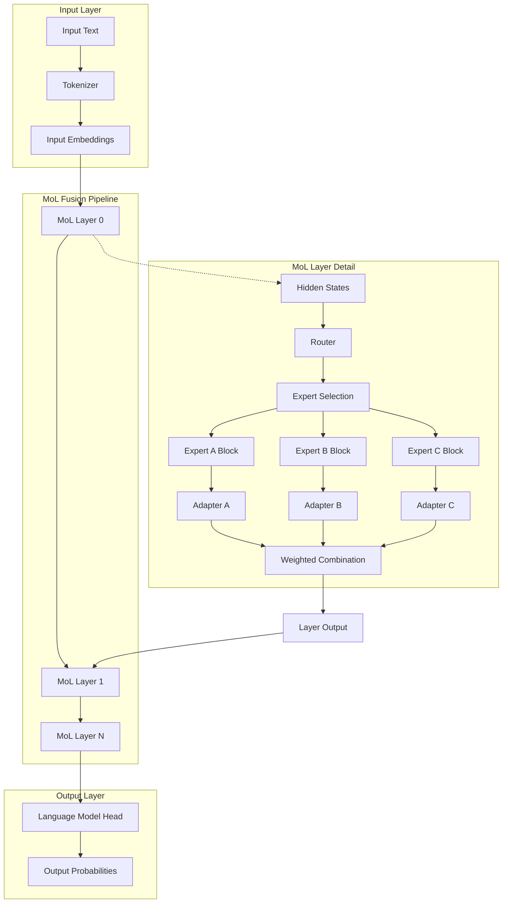

## 🔧 Core Components

### 1. MoL Runtime (`mol.core.mol_runtime`)

The central orchestrator that manages the entire fusion pipeline.

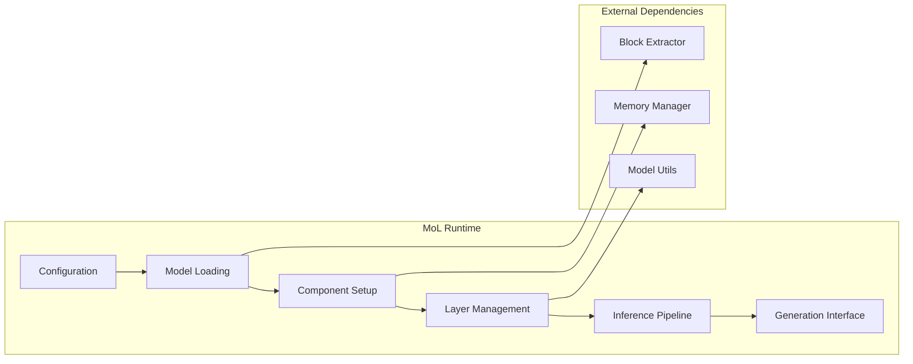

**Key Responsibilities:**
- Model initialization and configuration
- Layer composition and management
- Forward pass orchestration
- Memory and device management
- Checkpoint saving/loading

### 2. Block Extractor (`mol.core.block_extractor`)

Extracts transformer blocks from various model architectures.

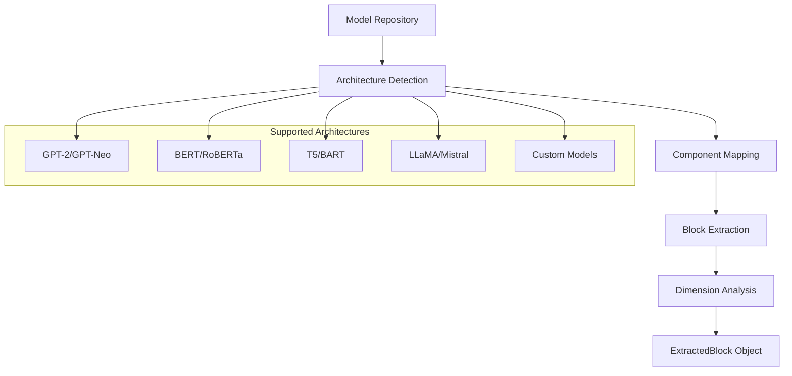

**Features:**
- Universal architecture support (120+ models)
- Automatic component discovery
- Safe model loading with trust controls
- Lazy loading and memory optimization

### 3. Adapters (`mol.core.adapters`)

Handle dimensional mismatches between different models.

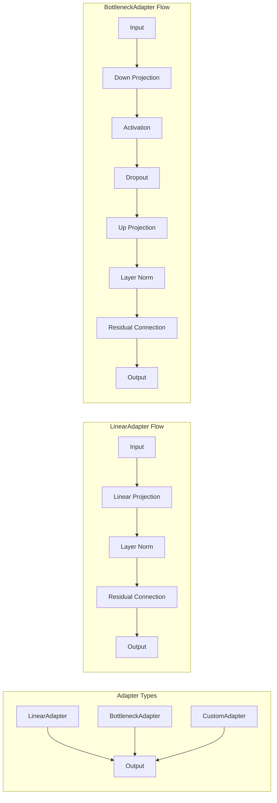

**Adapter Types:**
- **Linear**: Simple linear transformation
- **Bottleneck**: Parameter-efficient with compression
- **Custom**: User-defined adapters

### 4. Routers (`mol.core.routers`)

Intelligent expert selection mechanisms.

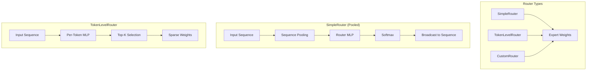

**Router Strategies:**
- **Simple (Pooled)**: One decision per sequence
- **Token-Level**: Per-token routing decisions
- **Top-K**: Sparse expert selection
- **Learned Temperature**: Adaptive decision sharpness

### 5. Universal Architecture Handler (`mol.core.universal_architecture`)

Automatic architecture detection and component mapping.

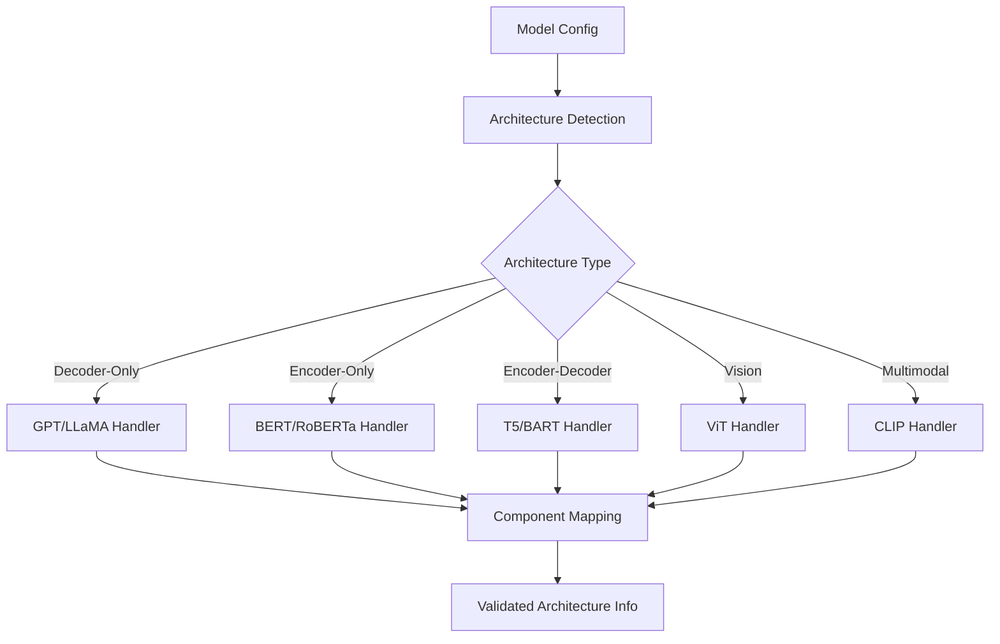

## 🔀 Model Merging Architecture

Separate from dynamic fusion, the merging system provides static model combination.

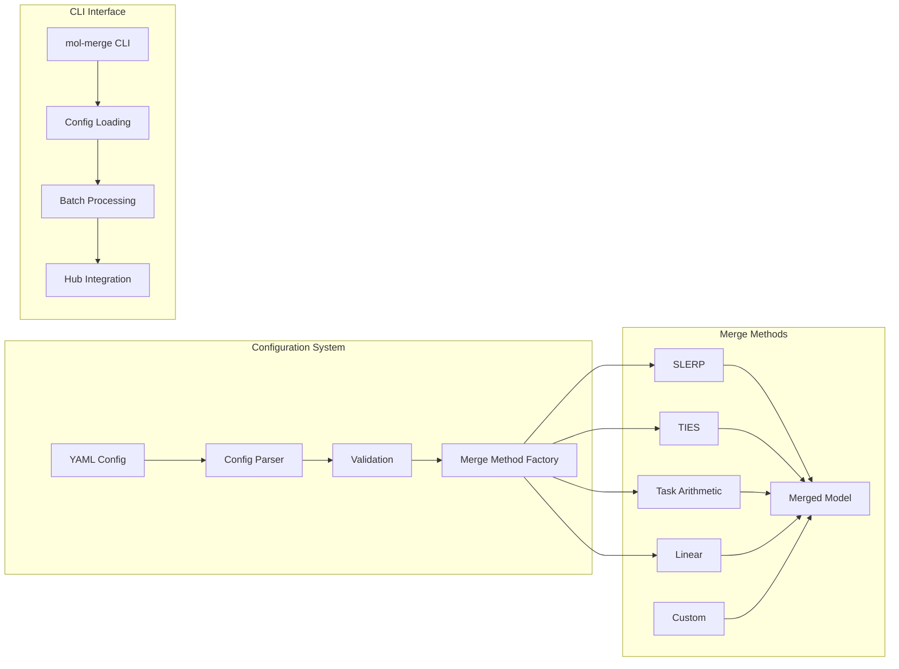

## 🧠 Training Architecture

The training system optimizes adapters and routers while keeping experts frozen.

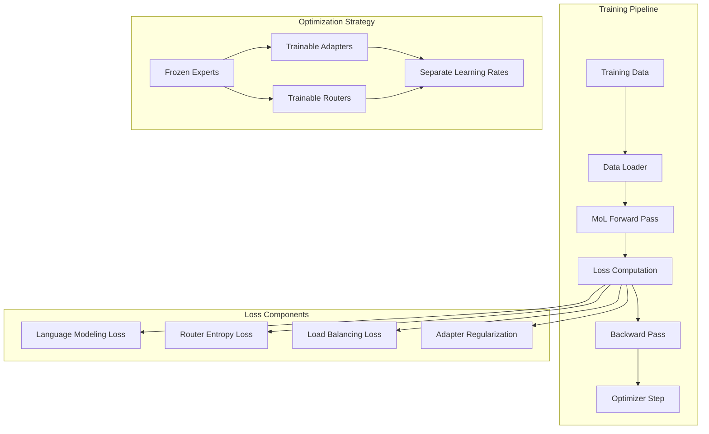

## 💾 Memory Management Architecture

Efficient memory usage through multiple optimization strategies.

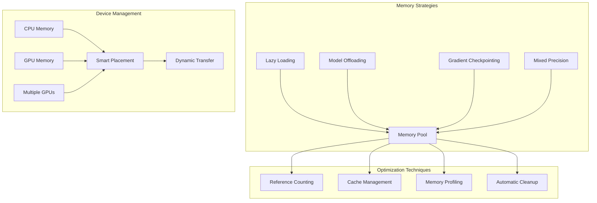

## 🔒 Security Architecture

Multi-layered security approach for safe model loading and execution.

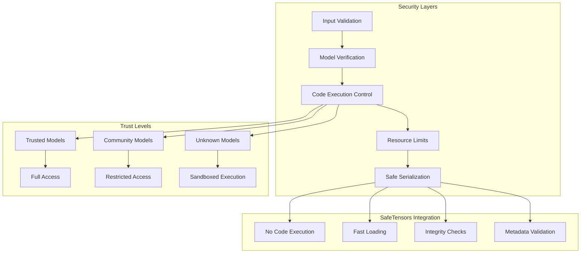

## 🌐 Integration Architecture

Seamless integration with the ML ecosystem.

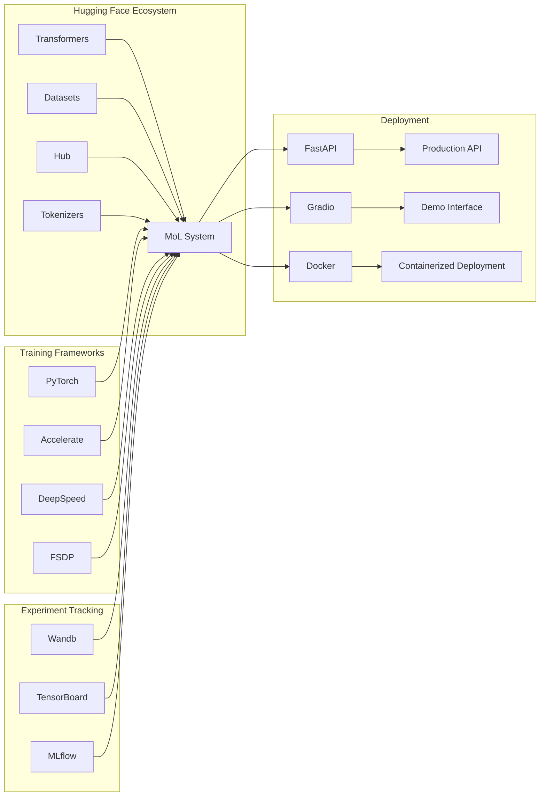

## 📊 Data Flow Architecture

Detailed data flow through the MoL system.

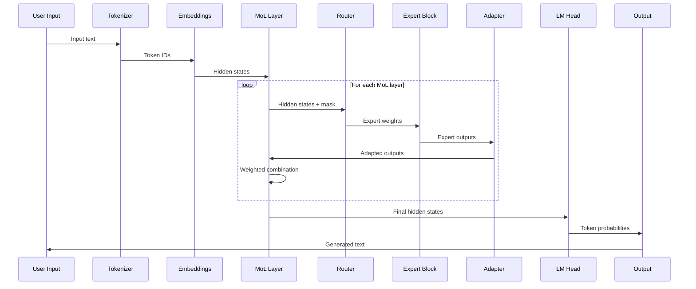

## 🔄 Configuration Architecture

Flexible configuration system supporting multiple input methods.

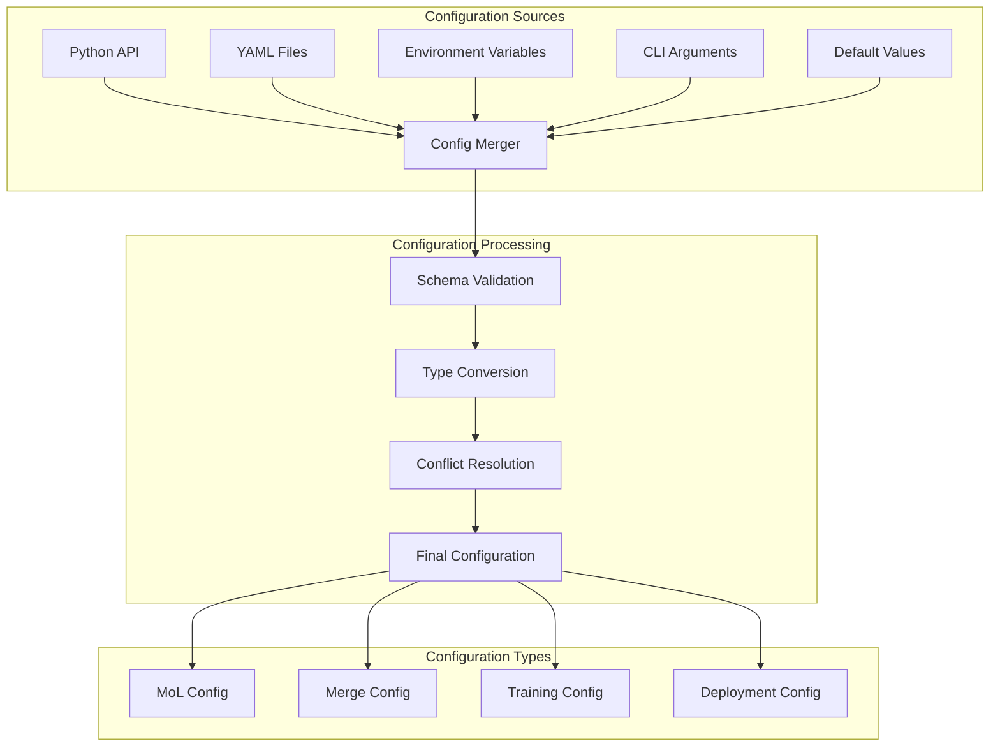

## 🚀 Performance Architecture

Optimization strategies for speed and efficiency.

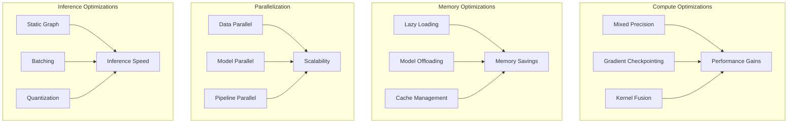

## 🔧 Extension Points

Architecture designed for extensibility and customization.

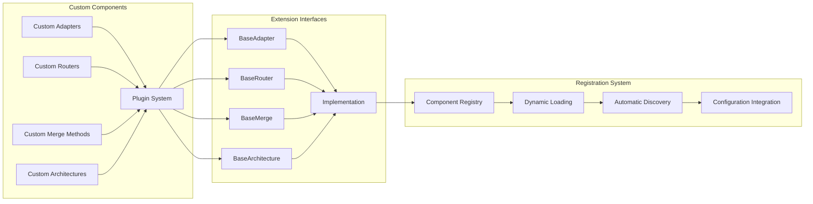

## 📈 Monitoring and Observability

Built-in monitoring for system health and performance.

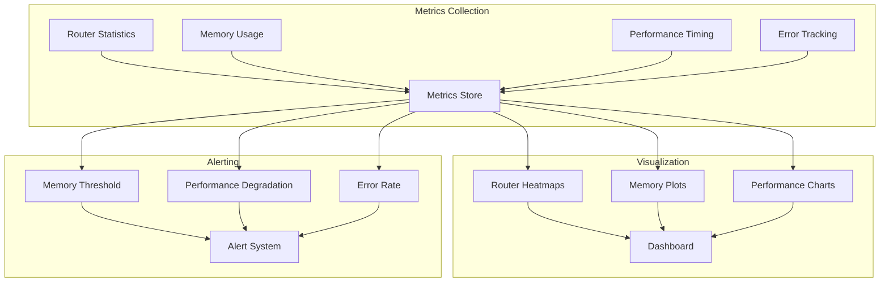

## 🎯 Design Patterns

Key design patterns used throughout the system:

### 1. **Strategy Pattern** - Routers and Adapters
Multiple interchangeable algorithms for routing and adaptation.

### 2. **Factory Pattern** - Component Creation
Centralized creation of adapters, routers, and merge methods.

### 3. **Observer Pattern** - Training Events
Event-driven training with customizable callbacks.

### 4. **Adapter Pattern** - Model Integration
Seamless integration with different model architectures.

### 5. **Composite Pattern** - Layer Composition
Hierarchical composition of fusion layers.

### 6. **Template Method Pattern** - Merge Methods
Consistent interface for different merging algorithms.

## 📚 Implementation Details

### Layer Composition

```python
class MoLLayer(nn.Module):
    """Single MoL fusion layer."""
    
    def __init__(self, experts, adapters, router):
        self.experts = nn.ModuleList(experts)
        self.adapters = nn.ModuleList(adapters)
        self.router = router
    
    def forward(self, x, attention_mask=None):
        # Router decision
        expert_weights, router_logits = self.router(x, attention_mask)
        
        # Expert computation
        expert_outputs = []
        for expert, adapter in zip(self.experts, self.adapters):
            expert_out = expert(x, attention_mask)
            adapted_out = adapter(expert_out)
            expert_outputs.append(adapted_out)
        
        # Weighted combination
        output = sum(w * out for w, out in zip(expert_weights, expert_outputs))
        
        return output, router_logits
```

### Memory Management

```python
class MemoryManager:
    """Efficient memory management for MoL."""
    
    def __init__(self):
        self.model_cache = {}
        self.memory_tracker = MemoryTracker()
    
    def get_model(self, model_name):
        if model_name not in self.model_cache:
            if self.memory_tracker.should_offload():
                self.offload_least_used()
            self.model_cache[model_name] = self.load_model(model_name)
        return self.model_cache[model_name]
```

## 🚀 Performance Characteristics

### Latency Profile

| Component | Latency Impact | Optimization |
|-----------|----------------|--------------|
| Router | Low (1-5ms) | Lightweight MLP |
| Adapter | Low (2-8ms) | Identity initialization |
| Expert Block | High (50-200ms) | Model size dependent |
| Memory Transfer | Medium (10-50ms) | Smart placement |

### Memory Usage

| Configuration | Peak Memory | Optimization |
|---------------|-------------|--------------|
| 2x Small Models | ~2GB | Baseline |
| 2x Medium Models | ~8GB | Offloading |
| 2x Large Models | ~20GB | Distributed |
| 4x Small Models | ~4GB | Lazy loading |

### Throughput Scaling

- **Single GPU**: 10-50 tokens/second (model dependent)
- **Multi-GPU**: Near-linear scaling with model parallelism
- **Distributed**: Scales to 8+ nodes with communication overhead

## 📖 Related Documentation

- [**API Reference**](api/) - Detailed component documentation
- [**Getting Started**](getting-started.md) - Basic usage patterns
- [**Advanced Topics**](advanced/) - Performance optimization
- [**Development Guide**](development.md) - Contributing to architecture

---

**Want to dive deeper?** Explore our [API Reference](api/) or check out [Advanced Topics](advanced/) for optimization techniques!