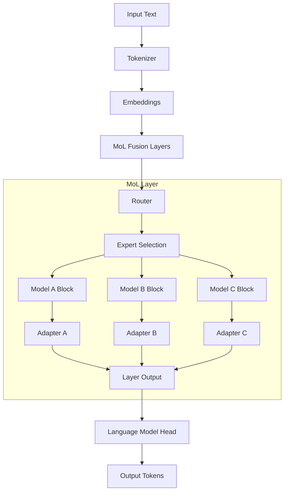

# Project Mango - MoL System Documentation 🥭

<div align="center">


[](https://opensource.org/licenses/MIT)
[](https://www.python.org/downloads/)
[](https://pytorch.org/)

**Modular Layer (MoL) System for Dynamic LLM Fusion with Advanced Model Merging**

[🚀 Quick Start](getting-started.md) • [📖 Tutorials](tutorials/) • [🔧 API Reference](api/) • [💡 Examples](examples/)

</div>

## 🌟 What is Project Mango?

Project Mango implements a revolutionary **Modular Layer (MoL) system** that enables dynamic fusion of transformer layers from different Large Language Models (LLMs). Unlike static model merging approaches, MoL preserves multiple model experts and uses intelligent routing to dynamically select the most appropriate model combination for each input.

### 🎯 Key Features

- **🔄 Dynamic Runtime Fusion**: Combine transformer layers from different LLMs at runtime
- **🔀 MergeKit-Style Model Merging**: Advanced merging with SLERP, TIES, Task Arithmetic, and Linear methods
- **⚡ Memory-Efficient Operations**: Lazy loading, smart device placement, and efficient memory management
- **🛠️ YAML Configuration System**: Easy-to-use configuration for complex merge specifications
- **🖥️ Professional CLI Interface**: Command-line tools similar to mergekit-yaml
- **🏗️ Universal Architecture Support**: Works with 120+ transformer architectures from Hugging Face
- **🔒 SafeTensors Integration**: Secure model serialization and loading
- **🌐 Hugging Face Hub Integration**: Seamless model sharing and deployment

## 🏗️ Architecture Overview



The MoL system consists of five core components:

1. **🔧 Block Extractors**: Extract transformer blocks from various model architectures
2. **⚙️ Adapters**: Handle dimensional mismatches between models
3. **🧭 Routers**: Intelligently select which expert model to use for each input
4. **🚀 MoL Runtime**: Orchestrates the entire fusion process
5. **📚 Training Pipeline**: Fine-tune adapters and routers for optimal performance

## 🚀 Quick Example

```python
from mol import MoLRuntime, MoLConfig

# Configure dynamic fusion
config = MoLConfig(
    models=["microsoft/DialoGPT-small", "distilgpt2"],
    adapter_type="linear",
    router_type="simple",
    max_layers=4
)

# Initialize and setup
mol = MoLRuntime(config)
mol.setup_embeddings()
mol.setup_lm_head()

# Add fusion layers
mol.add_layer([
    ("microsoft/DialoGPT-small", 0),
    ("distilgpt2", 0)
], layer_idx=0)

# Generate text with dynamic routing
inputs = mol.tokenizer("Hello, how are you?", return_tensors="pt")
output = mol.generate(inputs['input_ids'], max_length=50)
```

## 📊 Performance & Capabilities

### 🎯 Supported Model Families

| Architecture Family | Examples | MoL Support |
|-------------------|----------|-------------|
| **Decoder-Only** | GPT-2, GPT-Neo, Llama, Mistral, Falcon | ✅ Full Support |
| **Encoder-Only** | BERT, RoBERTa, DistilBERT, ELECTRA | ✅ Full Support |
| **Encoder-Decoder** | T5, BART, Pegasus, FLAN-T5 | ✅ Full Support |
| **Vision** | ViT, DeiT, Swin Transformer | ✅ Full Support |
| **Multimodal** | CLIP, FLAVA, LayoutLM | ✅ Full Support |

### 🚀 Performance Features

- **Memory Efficiency**: Up to 50% memory reduction with mixed precision
- **Dynamic Routing**: Token-level and pooled routing strategies
- **Lazy Loading**: Load model components only when needed
- **Device Management**: Smart GPU/CPU placement with fallback
- **Gradient Checkpointing**: Reduced memory footprint during training

## 📚 Documentation Structure

<div class="grid" markdown>

### 🚀 [Getting Started](getting-started.md)
Installation, setup, and your first MoL fusion

### 📖 [Tutorials](tutorials/)
Step-by-step guides for common use cases

### 🔧 [API Reference](api/)
Complete API documentation for all modules

### 💡 [Examples](examples/)
Code examples and demonstrations

### ⚙️ [Configuration](configuration.md)
YAML configs and CLI usage

### 🏗️ [Architecture](architecture.md)
System design and component details

### 🚀 [Advanced Topics](advanced/)
Performance optimization and best practices

### 👥 [Development](development.md)
Contributing guidelines and development setup

</div>

## 🔧 Installation

```bash
# Clone the repository
git clone https://github.com/your-username/project-mango.git
cd project-mango

# Install dependencies
pip install -r requirements.txt

# Install in development mode
pip install -e .
```

## 🎯 Use Cases

### 🔬 Research Applications
- **Model Architecture Studies**: Compare different transformer architectures
- **Transfer Learning**: Combine domain-specific and general models
- **Ablation Studies**: Analyze the contribution of different model components

### 🚀 Production Applications
- **Multi-Domain Chatbots**: Combine conversational and task-specific models
- **Specialized Language Models**: Merge models for code, science, and general text
- **Resource-Constrained Deployment**: Efficient model combinations for edge devices

### 🛠️ Development Workflows
- **Model Prototyping**: Quickly test model combinations
- **Gradual Model Updates**: Seamlessly integrate new model capabilities
- **A/B Testing**: Compare different fusion strategies in production

## 🤝 Community & Support

- **📖 Documentation**: Comprehensive guides and API reference
- **💬 Discussions**: Community forums for questions and ideas
- **🐛 Issues**: Bug reports and feature requests
- **🔧 Contributing**: Development guidelines and contribution process

## 📄 License

This project is licensed under the Apache License 2.0 - see the [LICENSE](../LICENSE) file for details.

## 🙏 Acknowledgments

- **Hugging Face Transformers**: Foundation for model loading and tokenization
- **PyTorch**: Core deep learning framework
- **MergeKit**: Inspiration for model merging methodologies
- **Research Community**: Contributions to transformer architecture understanding

---

<div align="center">

**Ready to start fusing models?** [Get Started →](getting-started.md)

Made with ❤️ by the Project Mango team

</div>